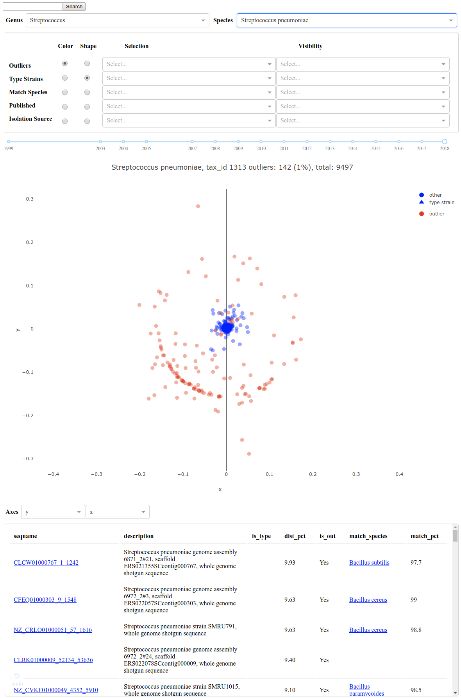

===============================================
NCBI Species Level 16s Reference Sequence Plots
===============================================

Web Site: https://deenurp.org/plots
Github: https://github.com/nhoffman/ya16sdb

Authors: Noah Hoffman, Chris Rosenthal

summary of features
===================

Users can browse Bacteria and Archea species using the Genus and 
Species dropdown menus.  Users can also search for sequences by 
seqname, species taxonomy id, or species taxonomy name using the 
search box or by url arguments.  Users can modify scatter plot markers 
by color and shape and use the Selection and Visibility drop down menus
to increase the size or visibility of the markers respectively.  Both
the Selection menu and plot selection tool will update the data table
below the plot layout and Axes dropdown menus.

standalone dev environment
==========================

Note that the dev application uses data in
``sq_order_tallies.feather.gz`` by default.

Set up::

  python3 -m venv py3-env
  source py3-env/bin/activate
  pip install -U pip
  pip install -r requirements.txt

Run the app::

  python app.py

The application will be served at ``http://127.0.0.1:8050``

dokku on local Vagrant instance
===============================

before starting
---------------

Be aware that certain network configurations including an active VPN
can interfer with the setup process.  We recommend disconnecting 
and disabling any VPN or manual network configuration before proceeding.

We'll mostly follow instructions here
(https://github.com/dokku/dokku/blob/master/docs/getting-started/install/vagrant.md),
with a few modifications.

After Vagrant is installed on your system (eg, ``brew install vagrant``),
clone the dokku repository and create a Vagrant instance,
for example (plan on getting a cup of coffee after the last command)::

  mkdir -p ~/src
  cd ~/src
  git clone https://github.com/dokku/dokku.git
  cd dokku
  vargrant up

Follow instructions at the url above to install your public key to the
dokku instance. I used ``dokku.me`` as the host name in the dokku
configuration form.

Add the following to ``~/.ssh/config``::

  Host dokku.me
    Port 22

There appears to be two users available for login: ``root``, which
provides an interactive prompt, and ``dokku`` which executes the
``dokku`` command instead of a shell. The latter user is used to issue
commands.

Now you should be able to ssh into the dokku instance and create the application::

  ssh dokku@dokku.me apps:create ya16sdb

Confirm that the application was created::

  % ssh dokku@dokku.me apps:list
  =====> My Apps
  ya16sdb

Define a git remote on the dokku host::

  git remote add dokku dokku@dokku.me:ya16sdb

Finally, we can deploy the application. Dokku expects the application
to be at the top level of the project repository, and because
``/dash`` is a subdirectory, we will use ``git subtree`` to push only
this directory (command must be executed in the root of the repo)::

  cd ya16sdb
  git subtree push --prefix dash dokku master

Now you should be able to access the application at
``http://ya16sdb.dokku.me``

mounting data
-------------

Details about the storage mounting plugin are here 
(https://github.com/dokku/dokku/blob/master/docs/advanced-usage/persistent-storage.md).

In summary, you will need to setup a folder with correct permissions on the
dokku instance and transfer your data before mounting::

  ssh dokku@dokku.me
  mkdir /var/lib/dokku/data/storage/ya16sdb

Exit and transfer your data file up::

  scp file.feather dokku@dokku.me:/var/lib/dokku/data/storage/ya16sdb

And, finally, mount::

  ssh dokku@dokku.me storage:mount ya16sdb /var/lib/dokku/data/storage/ya16sdb:/storage

Be aware there could be permission issues you may need to update with your
data file depending on many factors. Applying a `chmod a+r` to the file should
fix most issues.

Let's Encrypt plugin
--------------------

https://github.com/dokku/dokku-letsencrypt

troubleshooting dokku
---------------------

Within the dokku container, the application is served using
``gunicorn``. Confirm that the configuration in ``Procfile`` for
running ``gunicorn`` is working as expected like this::

  exec $(sed 's/web: //' Procfile)

This time the application is served at ``http://127.0.0.1:8000``
